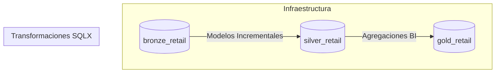
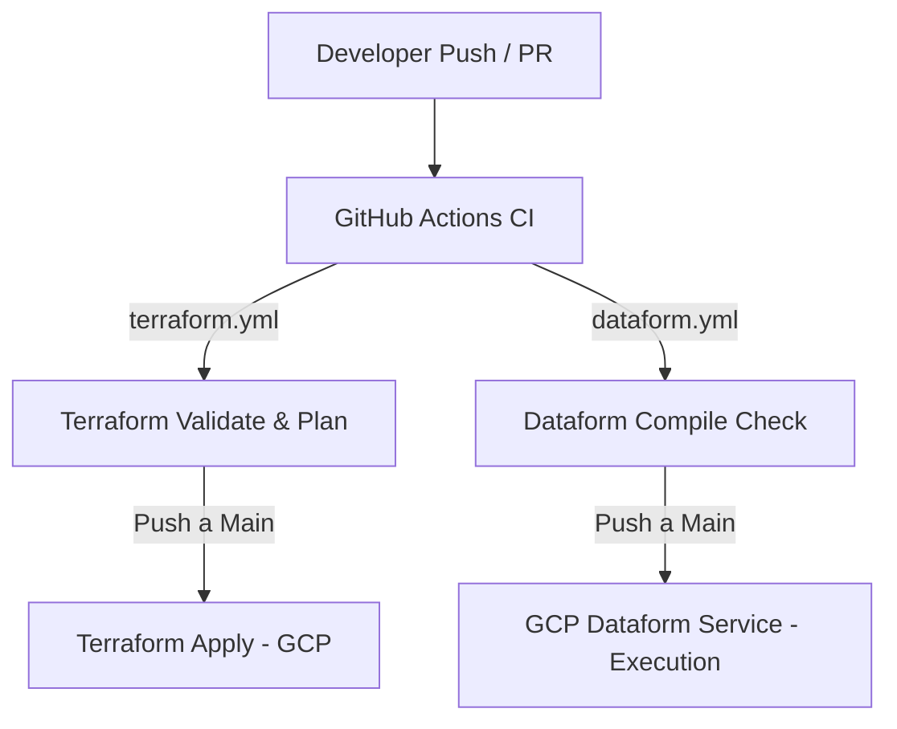

# 🚀 Modern Data Platform en GCP: Terraform + Dataform + GitOps CI/CD

Este repositorio implementa una plataforma de datos moderna en Google Cloud Platform (GCP) basada en la Arquitectura Medallion (Bronze, Silver, Gold). Utiliza un enfoque GitOps desacoplando la gestión de infraestructura base vía Terraform del modelado y transformación analítica vía Dataform.

---

## 🏗️ Arquitectura y Flujo GitOps

### 1. Separación de Responsabilidades

* **Terraform (Infraestructura IaaS):** Provisiona la estructura base en GCP: Datasets de BigQuery (`bronze_retail`, `silver_retail`, `gold_retail`), Buckets de GCS, Service Accounts y esquemas raw iniciales.
* **Dataform (Transformaciones / Data Engineering):** Administra el ciclo de vida de las tablas analíticas dentro de BigQuery. Realiza la limpieza, estandarización, cargas incrementales y pruebas de calidad de datos (assertions).



### 2. Flujo de Integración Continua (CI/CD)



* `terraform.yml`: Ejecuta `validate` y `plan` en ramas secundarias/PRs, y aplica los cambios (`apply`) únicamente en la rama `main`.
* `dataform.yml`: Instala el CLI de Dataform y valida en memoria la sintaxis de los modelos `.sqlx` y sus dependencias (`dataform compile`).

---

## 📂 Estructura del Monorepo

```text
.
├── .github/
│   └── workflows/
│       ├── dataform.yml            # Pipeline CI: Validación y compilación SQLX
│       └── terraform.yml           # Pipeline CI/CD: Validación y despliegue de Infraestructura
├── dataform/
│   ├── definitions/
│   │   ├── bronze/                 # Declaraciones de tablas base / fuentes
│   │   └── silver/                 # Transformaciones incrementales (.sqlx)
│   └── workflow_settings.yaml      # Configuración de entornos y compilación en GCP/Local
├── IAC/
│   ├── environment/
│   │   └── dev/
│   │       └── env.tfvars.json     # Variables locales de entorno (ignorado por Git)
│   ├── modules/
│   │   ├── bigquery_dataset/       # Módulo para creación de datasets (Bronze, Silver, Gold)
│   │   └── bigquery_table/         # Módulo para tablas base
│   ├── main.tf                     # Orquestador principal de Terraform
│   ├── provider.tf                 # Configuración de proveedores GCP
│   ├── variables.tf                # Variables globales
│   └── outputs.tf                  # Salidas del despliegue
├── LICENSE.md
└── README.md
```

---

## 🔑 Configuración de Secretos y Variables en GitHub

Para autorizar a GitHub Actions a interactuar con GCP de forma segura, debes configurar los siguientes parámetros en tu repositorio (`Settings -> Secrets and variables -> Actions`):

### Service Account Key (Secret)
* **Nombre:** `KEYGCP`
* **Valor:** El contenido de tu archivo JSON de credenciales de GCP codificado en Base64.

**Comando para codificar:**
* **Linux / WSL:** `base64 -w 0 key.json`
* **macOS:** `base64 -i key.json | tr -d '\n'`
* **PowerShell:** `[Convert]::ToBase64String([IO.File]::ReadAllBytes("key.json"))`

### Variables de Repositorio (Variables)
Crea las siguientes variables de entorno para que el pipeline genere dinámicamente los despliegues:

* `GCP_PROJECT`: ID de tu proyecto en GCP.
* `GCP_REGION`: Región por defecto (ej. `us-central1`).
* `BUCKET_NAME`: Nombre del bucket de almacenamiento.
* `ENVIRONMENT`: Entorno de despliegue (ej. `dev`).
* `PROVIDER`: Identificador o etiqueta del proveedor (ej. `orlando_data`).

---

## ⚙️ Modelos de Ejecución: Local vs. GitHub Actions

Este proyecto soporta dos enfoques de configuración de variables para adaptarse tanto al desarrollo local como a la automatización en la nube:

### Opción A: Desarrollo Local (Usando archivo físico `.tfvars.json`)
Para pruebas rápidas y desarrollo diario en tu máquina (WSL / Linux), utilizas un archivo estático local (el cual está protegido en el `.gitignore`):

1. **Preparar el entorno local (Node.js y Dataform CLI):**
   ```bash
   # Limpiar lista obsoleta de apt si fuera necesario y actualizar Node.js
   sudo rm -f /etc/apt/sources.list.d/google-cloud-sdk.list
   sudo apt update && sudo apt install -y nodejs npm
   sudo npm install -g @dataform/cli
   ```

2. **Ejecutar Terraform Localmente:**
   ```bash
   cd IAC
   terraform init
   terraform plan -var-file="environment/dev/env.tfvars.json"
   ```

3. **Compilar Dataform Localmente:**
   ```bash
   cd dataform
   npx @dataform/cli compile
   ```

### Opción B: Producción / CI-CD (Usando Variables de GitHub Actions)
En el pipeline automatizado (`.github/workflows/terraform.yml`), por seguridad no se sube ningún archivo `.tfvars.json` estático. En su lugar, el workflow lee las Variables del Repositorio configuradas en GitHub y genera el archivo de forma dinámica "al vuelo" justo antes de correr el plan de Terraform:

```yaml
- name: Generate Secure tfvars file
  run: |
    cat << EOF > environment/${{ vars.ENVIRONMENT }}/env.tfvars.json
    {
      "labels": {
        "provider": "${{ vars.PROVIDER }}"
      },
      "project": "${{ vars.GCP_PROJECT }}",
      "region": "${{ vars.GCP_REGION }}",
      "bucket_name": "${{ vars.BUCKET_NAME }}"
    }
    EOF

- name: Terraform Init & Plan
  run: |
    terraform init
    terraform plan -var-file="environment/${{ vars.ENVIRONMENT }}/env.tfvars.json" -out=tfplan
  env:
    GOOGLE_CREDENTIALS: key.json
```

---

## 🔄 Conexión con GCP Dataform Console

Para programar la ejecución en producción de tus transformaciones analíticas:

1. Dirígete a **BigQuery -> Dataform** en la consola de Google Cloud.
2. Crea y conecta un repositorio vinculado a este repositorio de GitHub mediante un Personal Access Token (PAT).
3. Configura el **Root directory** apuntando a la carpeta `dataform`.
4. Crea una **Release Configuration** vinculada a la rama `main`.
5. Define una **Workflow Configuration** estableciendo la periodicidad de ejecución (Cron) para correr los modelos incrementales y sus validaciones de calidad.