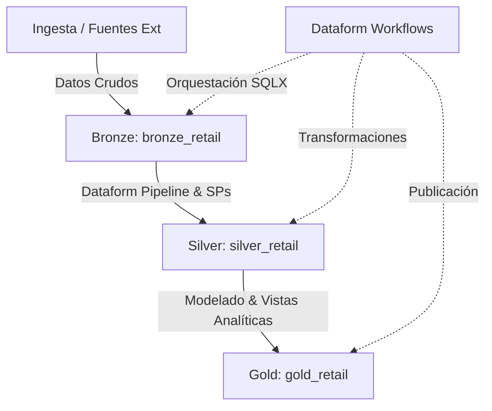
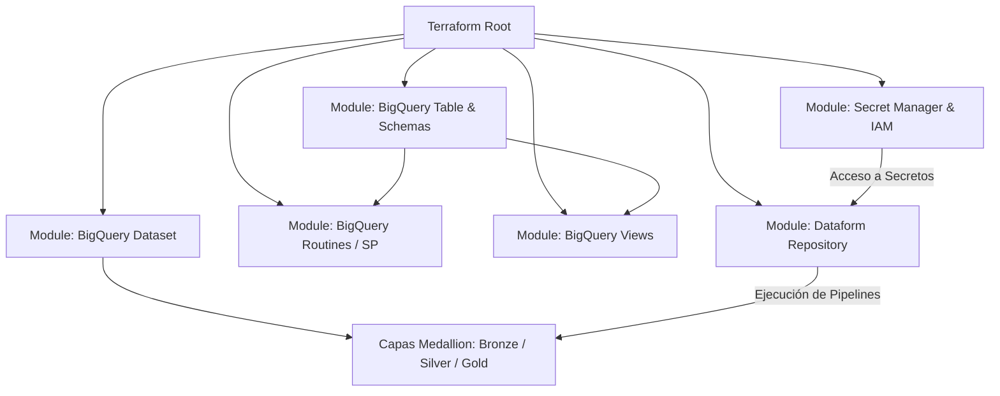

# 🚀 Modern Data Platform en GCP con Medallion Architecture, Terraform y Dataform


Repositorio de Infraestructura como Código (IaC) enfocado en la implementación automatizada de una plataforma de datos moderna en Google Cloud Platform (GCP). El proyecto implementa una **Arquitectura Medallion** en BigQuery, transformaciones automatizadas con **Dataform** y permite un despliegue dual: mediante **CI/CD con GitHub Actions** o de **forma local manual**.

## 📑 Tabla de Contenidos

* [🏛️ Diagramas de Arquitectura](#️-diagramas-de-arquitectura)
  * [1. Arquitectura de Datos (Medallion Architecture + Dataform)](#1-arquitectura-de-datos-medallion-architecture--dataform)
  * [2. Arquitectura de Despliegue e Infraestructura](#2-arquitectura-de-despliegue-e-infraestructura)
* [📂 Estructura del Monorepo](#-estructura-del-monorepo)
* [🔑 Configuración de IAM, Service Account y Llaves JSON](#-configuración-de-iam-service-account-y-llaves-json)
  * [1. Creación de la Service Account de Despliegue](#1-creación-de-la-service-account-de-despliegue)
  * [2. Asignación de Roles y Permisos (Detalle Técnico)](#2-asignación-de-roles-y-permisos-detalle-técnico)
  * [3. Gestión y Descarga de la Llave JSON (Manage Keys)](#3-gestión-y-descarga-de-la-llave-json-manage-keys)
* [🔐 Configuración de Secretos en GitHub y GCP Secret Manager](#-configuración-de-secretos-en-github-y-gcp-secret-manager)
  * [1. Habilitar y Configurar Secret Manager](#1-habilitar-y-configurar-secret-manager)
  * [2. Configuración e Identidad de Dataform](#2-configuración-e-identidad-de-dataform)
  * [3. Codificación Base64 para GitHub Secrets](#3-codificación-base64-para-github-secrets)
* [⚙️ Modos de Ejecución: Con CI/CD vs. Sin CI/CD](#️-modos-de-ejecución-con-cicd-vs-sin-cicd)
  * [Opción A: Con CI/CD (GitHub Actions) - Modo por Defecto](#opción-a-con-cicd-github-actions---modo-por-defecto)
  * [Opción B: Sin CI/CD (Pruebas Directas Locales)](#opción-b-sin-cicd-pruebas-directas-locales)
* [🛠️ Requisitos e Instalación Local (Ubuntu / WSL)](#️-requisitos-e-instalación-local-ubuntu--wsl)

---

## 🏛️ Diagramas de Arquitectura

El repositorio cuenta con dos perspectivas arquitectónicas clave:

### 1. Arquitectura de Datos (Medallion Architecture + Dataform)

El flujo organiza el almacenamiento analítico y el procesamiento modular con Dataform en capas desacopladas:

* **Capa Bronze (`bronze_retail`):** Ingesta cruda de datos transaccionales, tablas particionadas y esquemas versionados mediante JSON.
* **Capa Silver (`silver_retail`):** Limpieza, deduplicación y estandarización orquestada con **Dataform** / Procedimientos Almacenados.
* **Capa Gold (`gold_retail`):** Vistas analíticas y datamarts de negocio listos para consumo BI.



### 2. Arquitectura de Despliegue e Infraestructura

Estructura modular con Terraform y la integración de Secret Manager y Dataform en GCP:



---

## 📂 Estructura del Monorepo

```plaintext
.
├── .github/
│   └── workflows/
│       └── terraform.yml            # Pipeline CI/CD de GitHub Actions
├── IAC/
│   ├── environment/
│   │   └── dev/
│   │       └── env.tfvars.json      # Configuración de variables locales
│   ├── modules/
│   │   ├── bigquery_dataset/        # Gestión de datasets por capas
│   │   ├── bigquery_routine/        # Procedimientos almacenados SQL
│   │   ├── bigquery_table/          # Creación de tablas e inyección de esquemas JSON
│   │   ├── bigquery_view/           # Creación de vistas analíticas
│   │   ├── dataform/                # Repositorio y Workflows de Dataform
│   │   └── secret_manager/          # Configuración de Secret Manager y permisos IAM
│   ├── resources/
│   │   └── bigquery/                # Scripts SQL, schemas JSON y vistas de negocio
│   ├── main.tf                      # Orquestador principal de módulos
│   ├── provider.tf                  # Configuración del proveedor GCP
│   ├── variables.tf                 # Variables globales del sistema
│   └── outputs.tf                   # Salidas y outputs de recursos desplegados
├── LICENSE.md
└── README.md
```

---

## 🔑 Configuración de IAM, Service Account y Llaves JSON

Para permitir el despliegue automatizado de la infraestructura y pipelines desde GitHub Actions o localmente, se requiere una Service Account (SA) dedicada con los permisos mínimos necesarios.

### 1. Creación de la Service Account de Despliegue

En la consola de GCP o mediante `gcloud`:

```bash
gcloud iam service-accounts create sa-deployer-cicd \
    --description="Cuenta de servicio para despliegue de infraestructura y Dataform mediante CI/CD" \
    --display-name="SA Deployer CI/CD"
```

### 2. Asignación de Roles y Permisos (Detalle Técnico)

A continuación se detalla el propósito de cada rol asignado a la Service Account de despliegue (`sa-deployer-cicd`):

| Rol GCP | Identificador del Rol | Propósito y Justificación Técnica |
| :--- | :--- | :--- |
| **BigQuery Data Editor** | `roles/bigquery.dataEditor` | Permite crear, actualizar y eliminar datasets, tablas, vistas y rutinas SQL dentro de BigQuery en las capas Bronze, Silver y Gold. |
| **BigQuery Job User** | `roles/bigquery.jobUser` | Otorga permisos para ejecutar consultas (queries), cargar datos, ejecutar procedimientos almacenados y lanzar jobs de Dataform. |
| **Service Account User** | `roles/iam.serviceAccountUser` | Permite que el pipeline/deployer actúe e impersone las cuentas de servicio asociadas para ejecutar tareas delegadas (por ejemplo, Dataform Service Account). |
| **Storage Admin** | `roles/storage.admin` | Permite administrar completamente los buckets de Google Cloud Storage (GCS), necesario para la creación del bucket de Backend State de Terraform. |
| **Storage Object Admin** | `roles/storage.objectAdmin` | Control total para leer, escribir y eliminar archivos/objetos dentro de los buckets (gestión del archivo `.tfstate`). |
| **Storage Object Creator** | `roles/storage.objectCreator` | Permite crear nuevos objetos/logs en los buckets de almacenamiento temporal de datos. |
| **Storage Object Viewer** | `roles/storage.objectViewer` | Otorga permisos de lectura de esquemas, fuentes crudas o archivos estáticos subidos a Cloud Storage. |

### 3. Gestión y Descarga de la Llave JSON (Manage Keys)

Para obtener el archivo de credenciales `key.json`:

1. Dirígete a **IAM & Admin -> Service Accounts** en la consola de GCP.
2. Selecciona la cuenta de servicio creada (`sa-deployer-cicd`).
3. Haz clic en la pestaña **Keys** (Llaves).
4. Selecciona **Add Key -> Create new key**.
5. Elige el tipo **JSON** y presiona **Create**.
6. El archivo se descargará automáticamente a tu equipo. Renómbralo localmente como `key.json`.

---

## 🔐 Configuración de Secretos en GitHub y GCP Secret Manager

### 1. Habilitar y Configurar Secret Manager

GCP Secret Manager almacena información sensible utilizada por Dataform y GitHub Actions (por ejemplo, tokens SSH de repositorios o credenciales de conexión).

Crea un secreto base para el proyecto:

```bash
gcloud secrets create dataform-github-token \
    --replication-policy="automatic" \
    --project="ci-cd-dataform-gh-actions"
```

Asigna el rol **Secret Manager Secret Accessor** (`roles/secretmanager.secretAccessor`) a la cuenta por defecto o Service Account requerida para que pueda leer las claves en tiempo de ejecución.

### 2. Configuración e Identidad de Dataform

Dataform requiere crear una identidad de servicio administrada en Google Cloud Platform para gestionar sus recursos y conectarse a Secret Manager:

1. Ejecuta el comando en Cloud Shell para generar la identidad de servicio de Dataform:

```bash
gcloud beta services identity create \
    --service=dataform.googleapis.com \
    --project=ci-cd-dataform-gh-actions
```

Salida esperada:
```plaintext
Service identity created: service-385182679523@gcp-sa-dataform.iam.gserviceaccount.com
```

2. **Otorgar Permisos a la Service Identity de Dataform:**
   * Ve a la consola de GCP (**IAM & Admin -> IAM**), haz clic en **Grant Access** (Otorgar acceso) y agrega la cuenta creada (`service-385182679523@gcp-sa-dataform.iam.gserviceaccount.com`) con el siguiente rol:
     * **Secret Manager Secret Accessor** (`roles/secretmanager.secretAccessor`)

### 3. Codificación Base64 para GitHub Secrets

Para autenticar el pipeline de GitHub Actions de forma segura:

1. Codificar en Base64 desde la terminal (Ubuntu / WSL):

```bash
base64 -w 0 key.json
```

2. Configurar en GitHub Secrets:
   * Ve a tu repositorio en GitHub -> **Settings -> Secrets and variables -> Actions**.
   * Crea un nuevo secreto con el nombre `KEYGCP` y pega la cadena codificada.

---

## ⚙️ Modos de Ejecución: Con CI/CD vs. Sin CI/CD

### Opción A: Con CI/CD (GitHub Actions) - Modo por Defecto

El pipeline (`.github/workflows/terraform.yml`) lee las variables configuradas en GitHub (`GCP_PROJECT`, `GCP_REGION`, `BUCKET_NAME`, `PROVIDER`, `ENVIRONMENT`) y genera dinámicamente el archivo de variables antes de la ejecución de Terraform.

### Opción B: Sin CI/CD (Pruebas Directas Locales)

Para pruebas directas en local:

1. Crea tu archivo local `IAC/environment/dev/env.tfvars.json` (asegúrate de que esté listado en `.gitignore`).
2. Modifica temporalmente el workflow `.github/workflows/terraform.yml` para omitir la generación dinámica y usar el archivo estático:

```yaml
# - name: Generate Secure tfvars file
#   run: |
#     ...

- name: Terraform Init & Plan
  run: |
    terraform init
    terraform plan -var-file="environment/${{ vars.ENVIRONMENT }}/env.tfvars.json" -out=tfplan
  env:
    GOOGLE_CREDENTIALS: key.json
```

---

## 🛠️ Requisitos e Instalación Local (Ubuntu / WSL)

### 1. Instalar Terraform

```bash
sudo apt-get update && sudo apt-get install -y gnupg software-properties-common
wget -O- https://apt.releases.hashicorp.com/gpg | gpg --dearmor | sudo tee /usr/share/keyrings/hashicorp-archive-keyring.gpg > /dev/null
echo "deb [signed-by=/usr/share/keyrings/hashicorp-archive-keyring.gpg] https://apt.releases.hashicorp.com $(lsb_release -cs) main" | sudo tee /etc/apt/sources.list.d/hashicorp.list
sudo apt-get update && sudo apt-get install terraform=1.9.5
```

### 2. Autenticación Local en GCP

```bash
gcloud auth login
gcloud auth application-default login
```

### 3. Despliegue Manual Local

```bash
cd IAC
terraform init
terraform plan -var-file="environment/dev/env.tfvars.json"
terraform apply -var-file="environment/dev/env.tfvars.json"
```