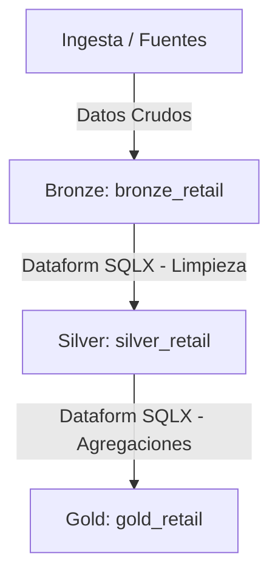
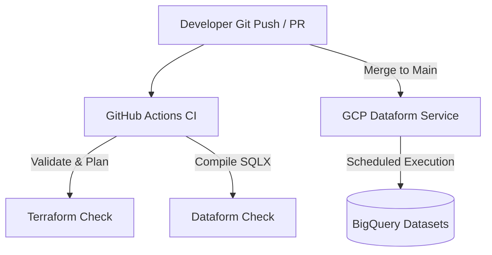

# 🚀 Modern Data Platform en GCP con Medallion Architecture, Terraform y Dataform

Repositorio bajo enfoque **GitOps** enfocado en la implementación de una plataforma de datos moderna en Google Cloud Platform (GCP). Implementa una **Arquitectura Medallion** en BigQuery separando la infraestructura base (vía **Terraform**) de la capa de transformaciones analíticas (vía **Dataform**).

---

## 🏗️ Diagramas de Arquitectura

### 1. Arquitectura de Datos & Separación de Responsabilidades
El flujo organiza el almacenamiento analítico y el procesamiento en capas desacopladas:
* **Capa Bronze (`bronze_retail`):** Ingesta cruda de datos transaccionales, tablas particionadas y esquemas versionados mediante JSON. Gestionada en infraestructura por Terraform y refinada por Dataform.
* **Capa Silver (`silver_retail`):** Limpieza, consolidación, deduplicación y reglas de negocio ejecutadas mediante transformaciones `.sqlx` en Dataform.
* **Capa Gold (`gold_retail`):** Modelado analítico y tablas agregadas finales para consumo BI, gestionadas en Dataform.



### 2. Flujo de CI/CD y Orquestación (GitOps)
* **GitHub Actions (CI):** Valida sintaxis/plan de Terraform (`terraform.yml`) y compila las transformaciones SQLX (`dataform.yml`) en cada Pull Request.
* **GCP Dataform (CD/Orquestación):** Lee de forma nativa la carpeta `/dataform` de la rama `main` mediante un *Release & Workflow Configuration* para ejecutar las transformaciones programadas directamente en BigQuery.



---

## 📂 Estructura del Proyecto (Monorepo)

```text
.
├── .github/
│   └── workflows/
│       ├── dataform.yml             # Pipeline CI: Validación y compilación SQLX
│       └── terraform.yml            # Pipeline CI/CD: Validación y despliegue de Infraestructura
├── dataform/
│   ├── definitions/
│   │   ├── bronze/                  # Modelos SQLX de ingesta/limpieza inicial
│   │   └── silver/                  # Modelos SQLX de transformaciones e intermedias
│   ├── dataform.json                # Configuración global de Dataform
│   └── workflow_settings.yaml       # Configuración de entornos y compilación
├── IAC/
│   ├── environment/
│   │   └── dev/
│   │       └── env.tfvars.json      # Variables para ejecuciones locales
│   ├── modules/
│   │   ├── bigquery_dataset/        # Módulo para creación de datasets (Bronze, Silver, Gold)
│   │   └── bigquery_table/          # Módulo para creación de tablas e inyección de esquemas JSON
│   ├── resources/
│   │   └── bigquery/schemas/        # Esquemas JSON de definición de tablas base
│   ├── main.tf                      # Orquestador principal de infraestructura
│   ├── provider.tf                  # Configuración del proveedor GCP
│   ├── variables.tf                 # Variables globales de Terraform
│   └── outputs.tf                   # Outputs de recursos creados
├── LICENSE.md
└── README.md
```

---

## 🔐 Configuración de Secretos en GitHub (Base64)

Para la autenticación segura del pipeline de GitHub Actions en GCP:

1. **Generar la clave en GCP:** Descarga el archivo JSON de tu Service Account desde GCP.
2. **Codificar en Base64 sin saltos de línea:**
   * **Ubuntu / WSL:** `base64 -w 0 key.json`
   * **macOS:** `base64 -i key.json | tr -d '\n'`
   * **PowerShell:** `[Convert]::ToBase64String([IO.File]::ReadAllBytes("key.json"))`
3. **Configurar en GitHub:**
   * Ve a **Settings -> Secrets and variables -> Actions**.
   * Agrega el secreto `KEYGCP` pegando la cadena codificada.
   * Asegúrate de tener definidas las Repository variables: `GCP_PROJECT`, `GCP_REGION`, `BUCKET_NAME`, `PROVIDER` y `ENVIRONMENT`.

---

## ⚙️ Despliegue de Infraestructura (Terraform)

El pipeline `.github/workflows/terraform.yml` automatiza la creación de la infraestructura:
* **En Pull Requests / Pushes a ramas secundarias:** Ejecuta `terraform validate` y `terraform plan` generando el archivo de variables dinámicamente.
* **En Push a `main`:** Ejecuta `terraform apply` aplicando los cambios en producción.

---

## 🔄 Conexión y Orquestación con GCP Dataform

Para activar la ejecución de las transformaciones de datos en BigQuery:

1. Ir a la consola de GCP -> **BigQuery -> Dataform**.
2. Crear un repositorio conectado a este repositorio de GitHub (vía Personal Access Token).
3. Establecer el **Root directory** en las opciones avanzadas como: `dataform`.
4. Crear una **Release Configuration** apuntando a la rama `main`.
5. Crear una **Workflow Configuration** definiendo el horario de ejecución (Cron) y la Service Account con permisos en BigQuery.

---

## 🛠️ Ejecución Local (Desarrollo y Debugging)

### Autenticación y Terraform Local
```bash
cd IAC
terraform init
terraform plan -var-file="environment/dev/env.tfvars.json"
```

### Compilación Local de Dataform
```bash
cd dataform
dataform compile